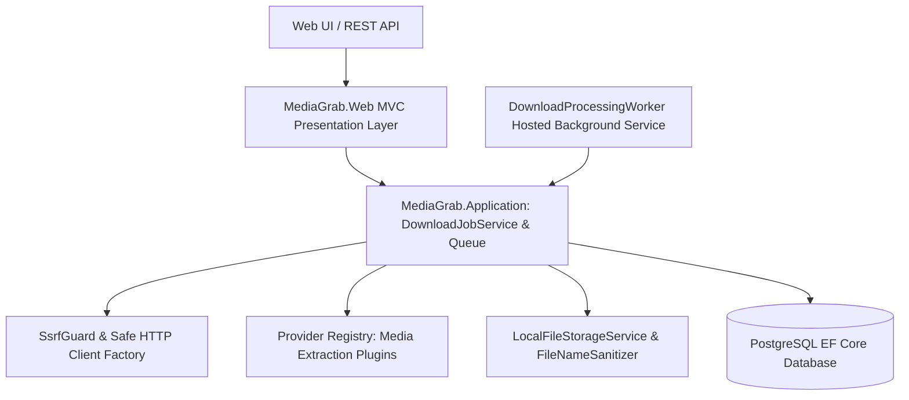

# MediaGrab — Multi-Provider Media Processing & Ingestion Service

<div align="center">

[](https://github.com/abdussatarkhan)
[](https://github.com/abdussatarkhan)
[](https://github.com/abdussatarkhan)

</div>

[](https://github.com/abdussatarkhan/media-grab/actions)
[](https://learn.microsoft.com/en-us/dotnet/)
[](https://learn.microsoft.com/en-us/dotnet/csharp/)
[](https://www.postgresql.org/)
[](https://www.docker.com/)

> **A high-performance ASP.NET Core (.NET 8) platform designed with Clean Architecture, background download workers, and SSRF-safe HTTP pipelines — for analyzing metadata, extracting video/audio streams, and managing file downloads across multiple media providers.**

---

## 🏛️ System Architecture



---

## 🌟 Key Features & Capabilities

- **🏛️ Clean Architecture Multi-Project Solution**: Modular separation across `MediaGrab.Domain`, `MediaGrab.Application`, `MediaGrab.Infrastructure`, `MediaGrab.Web`, and unit tests in `MediaGrab.Tests`.
- **⚡ Asynchronous Queue & Background Worker**: Uses `IDownloadQueue` and hosted `DownloadProcessingWorker` for non-blocking asynchronous stream downloads and progress tracking.
- **🛡️ Enterprise SSRF Guard & Security**: Robust `SsrfGuard` validates URLs against internal IP ranges (RFC 1918), local loopback addresses, and cloud metadata services to prevent server-side request forgery.
- **🧹 File Sanitization & Local Storage**: `FileNameSanitizer` cleans incoming filenames to neutralize directory traversal and illegal path payloads.

---

## 🚀 Quickstart & Setup

### Prerequisites
- [.NET 8 SDK](https://dotnet.microsoft.com/download/dotnet/8.0)
- [PostgreSQL](https://www.postgresql.org/download/) or Docker

### 1. Clone the Repository
```bash
git clone https://github.com/abdussatarkhan/media-grab.git
cd media-grab
```

### 2. Run Tests & Launch Web Application
```bash
# Restore dependencies
dotnet restore

# Run test suites
dotnet test

# Run the web application
dotnet run --project MediaGrab.Web
```

Open your browser at:
`https://localhost:5001` or `http://localhost:5000`

---

## 🖥️ Application & Operational Interface

<p align="center">
  
</p>

> [!TIP]
> You can also explore [`dashboard.html`](dashboard.html) directly in any modern browser for a standalone interface walkthrough.

---

## 🗺️ Roadmap & Upcoming Enhancements

- [x] Clean Architecture solution with Domain, App, Infra, and Web layers
- [x] SSRF-safe HTTP client factory and file sanitization
- [x] Asynchronous background download queue and worker
- [ ] Multi-threaded segmented chunk downloading
- [ ] AWS S3 and Azure Blob Cloud storage provider plugins
- [ ] FFmpeg audio/video transcode transcoding pipeline

---

## 👨‍💻 Author & Contact

Built and maintained by **Abdussatar** ([@abdussatarkhan](https://github.com/abdussatarkhan)).  
For technical discussions, collaboration, or queries, feel free to reach out via [LinkedIn](https://www.linkedin.com/in/abdus-satar-5150813b5/) or [GitHub](https://github.com/abdussatarkhan).

---

## 📜 License

This project is licensed under the **MIT License** — see the LICENSE file for details.

---

<div align="center">

### 👨‍💻 Maintained by [Abdussatar (@abdussatarkhan)](https://github.com/abdussatarkhan)
Part of the **[Abdussatar Software Engineering & Systems Portfolio](https://github.com/abdussatarkhan)**.

⭐ If you find this project valuable, consider dropping a star! ⭐

</div>
