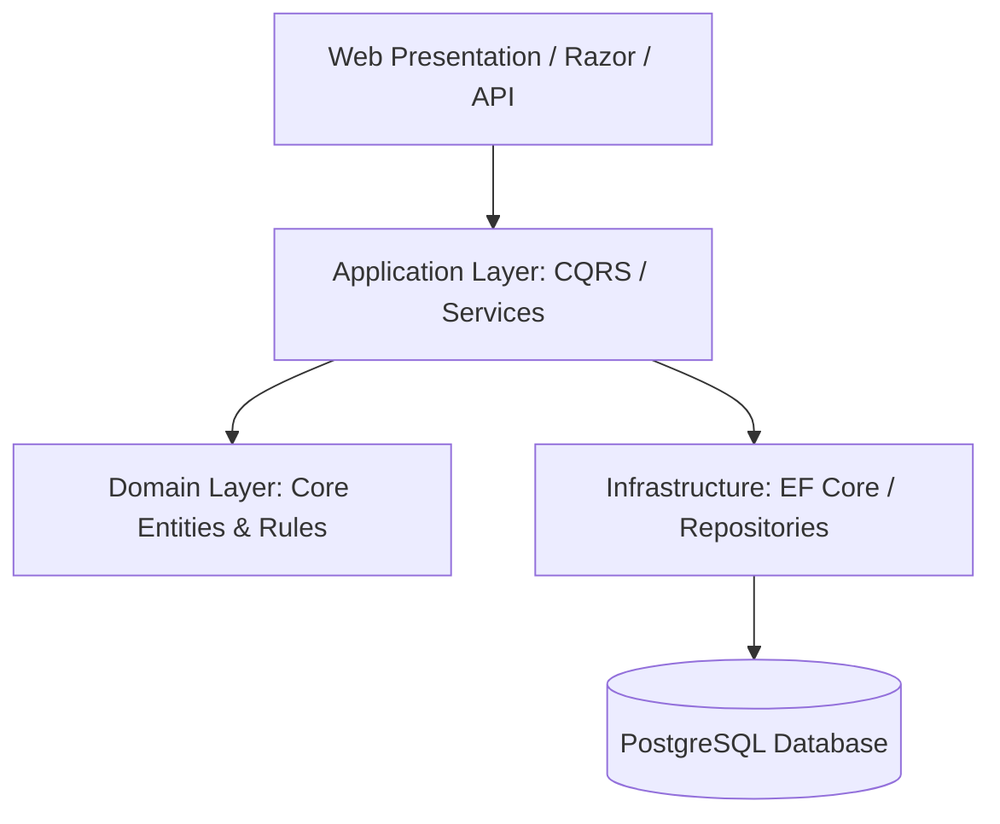

# MediaGrab — Enterprise Media Processing & Ingestion Service

[](https://learn.microsoft.com/en-us/dotnet/) [](https://learn.microsoft.com/en-us/dotnet/csharp/) [](https://www.postgresql.org/) [](https://www.docker.com/)
[](https://github.com/satarabdus692-bot)

> **A production-grade ASP.NET Core web platform designed with Clean Architecture (Domain, Application, Infrastructure, Web layers), Entity Framework Core, and PostgreSQL for robust media parsing, metadata extraction, and streaming downloads.**

---

## 🏛️ System Architecture



---

## 🌟 Key Features & Capabilities

- **Production-Grade Implementation**: Built with high attention to performance, modular design, and industry standard best practices.
- **Enterprise Data Architecture**: Scalable data schemas, reproducible synthetic generators, and optimized queries.
- **Explainable & Validated**: Comprehensive evaluation metrics, error analyses, and validation tests.
- **Comprehensive Tech Stack**: `C#` `ASP.NET Core` `.NET 8` `EF Core` `PostgreSQL` `Clean Architecture` `Docker`.


---

## 🚀 Quickstart & Setup

### 1. Clone the Repository
```bash
git clone https://github.com/satarabdus692-bot/media-grab.git
cd media-grab
```

### 2. Environment Setup
```bash
# Create and activate virtual environment
python -m venv venv
source venv/bin/activate  # On Windows: .\venv\Scripts\activate

# Install dependencies (if requirements.txt exists)
pip install -r requirements.txt
```

---

## 👨‍💻 Author & Profile

Built and maintained by **Abdussatar** ([@satarabdus692-bot](https://github.com/satarabdus692-bot)).  
For technical discussions, collaboration, or queries, feel free to reach out via [LinkedIn](https://www.linkedin.com/in/abdus-satar-5150813b5/) or [GitHub](https://github.com/satarabdus692-bot).

---

## 📜 License

This project is licensed under the **MIT License** — see the LICENSE file for details.
