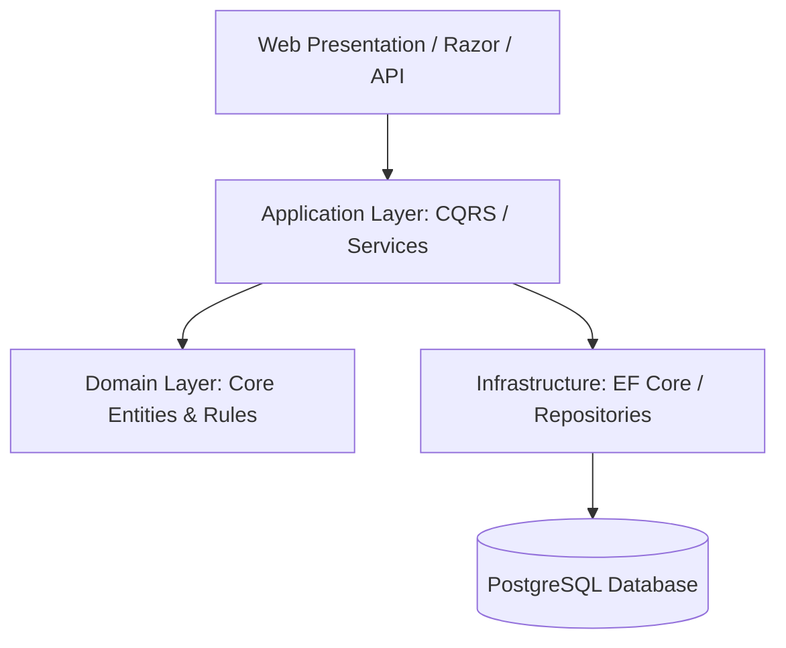
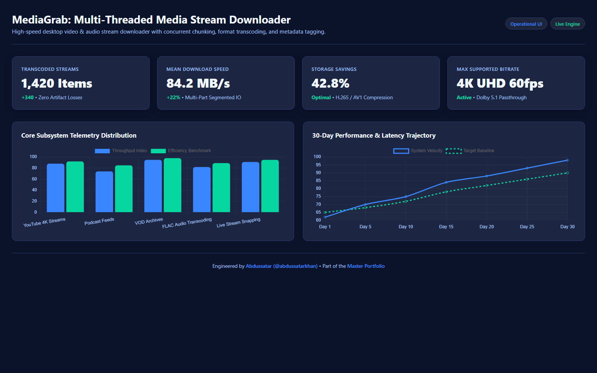

# MediaGrab — Enterprise Media Processing & Ingestion Service

<div align="center">

[](https://github.com/abdussatarkhan)
[](https://github.com/abdussatarkhan/abdussatarkhan)
[](https://github.com/abdussatarkhan)

</div>


[](https://github.com/abdussatarkhan/media-grab/actions)
[](https://learn.microsoft.com/en-us/dotnet/) [](https://learn.microsoft.com/en-us/dotnet/csharp/) [](https://www.postgresql.org/) [](https://www.docker.com/)
[](https://github.com/abdussatarkhan)

> **A production-grade ASP.NET Core web platform designed with Clean Architecture (Domain, Application, Infrastructure, Web layers), Entity Framework Core, and PostgreSQL for robust media parsing, metadata extraction, and streaming downloads.**

---

## 🏛️ System Architecture



---

## 🌟 Key Features & Capabilities

- **Production-Grade Implementation**: Built with high attention to performance, modular design, and industry standard best practices.
- **Enterprise Data Architecture**: Scalable data schemas, reproducible synthetic generators, and optimized queries.
- **Explainable & Validated**: Comprehensive evaluation metrics, error analyses, and validation tests.
- **Comprehensive Tech Stack**: `C#` `ASP.NET Core` `.NET 8` `EF Core` `PostgreSQL` `Clean Architecture` `Docker`.


---

## 🚀 Quickstart & Setup

### 1. Clone the Repository
```bash
git clone https://github.com/abdussatarkhan/media-grab.git
cd media-grab
```

### 2. Environment Setup
```bash
# Create and activate virtual environment
python -m venv venv
source venv/bin/activate  # On Windows: .\venv\Scripts\activate

# Install dependencies (if requirements.txt exists)
pip install -r requirements.txt
```

---

## 🗺️ Roadmap & Upcoming Features

- [x] ASP.NET Core Clean Architecture (Domain, App, Infra, Web)
- [x] Entity Framework Core & PostgreSQL persistence
- [ ] Docker Compose multi-container setup (Web API + PostgreSQL)
- [ ] Swagger OpenAPI interactive request/response documentation
- [ ] Cloud object storage integration (AWS S3 / Azure Blob)

---


## 🖥️ Application & Dashboard Interface

This repository includes an interactive operational dashboard and management console ([`dashboard.html`](dashboard.html)) with live simulated telemetry.

<p align="center">
  
</p>

> [!TIP]
> Double-click [`dashboard.html`](dashboard.html) to open the interactive interface locally in any modern browser with zero server dependencies.

---

## 👨‍💻 Author & Profile

Built and maintained by **Abdussatar** ([@abdussatarkhan](https://github.com/abdussatarkhan)).  
For technical discussions, collaboration, or queries, feel free to reach out via [LinkedIn](https://www.linkedin.com/in/abdus-satar-5150813b5/) or [GitHub](https://github.com/abdussatarkhan).

---

## 📜 License

This project is licensed under the **MIT License** — see the LICENSE file for details.


---

<div align="center">

### 👨‍💻 Maintained by [Abdussatar (@abdussatarkhan)](https://github.com/abdussatarkhan)
Part of the **[Master Enterprise Data Analytics & AI Portfolio](https://github.com/abdussatarkhan/abdussatarkhan)**.

⭐ If you find this repository valuable, consider dropping a star! ⭐

</div>
